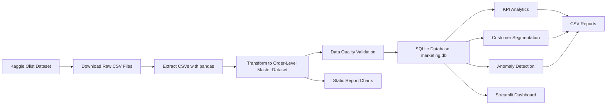
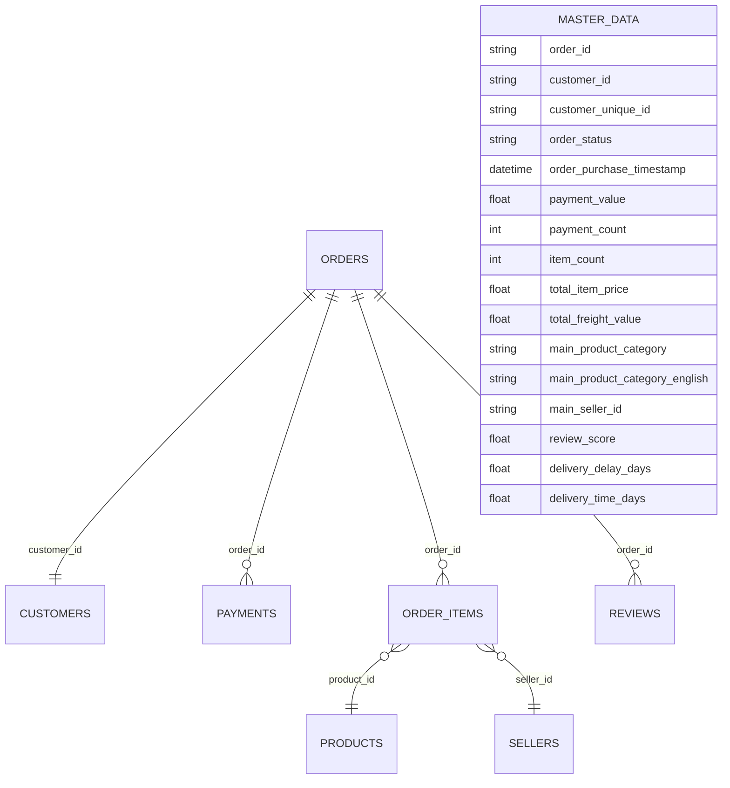

# 📊 Marketing Intelligence Platform

<p align="center">
  
</p>

<p align="center">
  
  
  
</p>

<p align="center">
  
  
</p>

<p align="center">
  <b>End-to-end Data Engineering + Analytics + Machine Learning + BI Dashboard project using the Brazilian E-Commerce Public Dataset by Olist.</b>
</p>

This project simulates a real-world e-commerce analytics platform that transforms raw transactional data into a clean analytical dataset, validates data quality, calculates business KPIs, applies machine learning, stores curated data in SQLite, generates reports, and exposes insights through an interactive Streamlit dashboard.

---

## 👨‍💻 Authors

- **Ruturaj Mokashi**
- **Nathanael Matutis**

---

## 🚀 Project Objective

The objective of this project is to build a professional analytics system that can:

- download and process raw e-commerce data
- build a clean order-level analytical dataset
- prevent incorrect metrics caused by bad joins
- calculate business KPIs
- perform customer segmentation
- detect anomalies
- generate automated reports and visualizations
- provide an interactive Streamlit dashboard
- validate pipeline logic using unit tests
- demonstrate production-style Git and environment hygiene

---

## 🔍 Problem Statement

Modern e-commerce platforms generate large volumes of operational and transactional data. However, raw data is often spread across multiple relational tables and is not immediately suitable for business reporting.

Common analytics challenges include:

- identifying revenue drivers
- understanding customer behavior
- calculating repeat customer rate correctly
- evaluating seller performance
- detecting delivery delays
- avoiding inflated KPIs due to incorrect joins
- creating reliable reporting data for BI users

This project solves these problems by creating a structured analytics pipeline and dashboard.

---

## 💡 Solution Overview

The platform converts raw Olist CSV files into business-ready insights through:

- a modular ETL pipeline
- an order-level master dataset
- data quality checks
- a SQLite analytical database
- KPI calculation modules
- customer segmentation using KMeans
- anomaly detection using Isolation Forest
- automated CSV and chart outputs
- an interactive Streamlit dashboard
- pytest-based validation
- GitHub Actions CI integration

---

## 🧠 Key Professional Concepts

### 1. Correct Data Grain

The final analytical table uses the following grain:

> **One row = one order**

This is critical because the Olist dataset contains several one-to-many relationships.

For example:

```text
one order → multiple payment rows
one order → multiple item rows
```

If raw payments and raw items are merged directly, pandas can create a many-to-many row explosion:

```text
2 payment rows × 3 item rows = 6 fake rows
```

That can inflate revenue, item counts, and other KPIs.

This project prevents that by aggregating payments and items to order level before merging.

---

### 2. Correct Customer Identity

For customer analytics, the project uses:

```text
customer_unique_id
```

instead of relying only on:

```text
customer_id
```

In the Olist dataset, `customer_id` is tied to an order-level customer record, while `customer_unique_id` identifies the same real customer across multiple purchases.

This matters for:

- repeat customer rate
- orders per customer
- customer segmentation
- retention-style analysis

---

### 3. Separate Main and Dashboard Environments

The project uses two Python environments:

| Environment | Purpose |
|---|---|
| `venv` | Main ETL pipeline, analytics, tests, reporting, SQLite loading |
| `dashboard-venv` | Streamlit dashboard only |

This separation keeps the main ETL pipeline stable and avoids dependency conflicts caused by Streamlit/PyArrow on macOS.

---

## 🏗️ Architecture



---

## 🧱 Data Model



---

## 📦 Dataset

This project uses the **Brazilian E-Commerce Public Dataset by Olist** from Kaggle.

Dataset identifier:

```text
olistbr/brazilian-ecommerce
```

The raw dataset contains multiple relational CSV files:

| Dataset | Purpose |
|---|---|
| customers | Customer and location information |
| orders | Order lifecycle and timestamps |
| order_items | Product-level order line items |
| order_payments | Payment values, installments, payment types |
| order_reviews | Customer satisfaction and reviews |
| products | Product metadata and categories |
| sellers | Seller location and seller identifiers |
| geolocation | Regional latitude/longitude data |
| category translation | English product category names |

Raw files are downloaded into:

```text
data/raw/
```

This folder is ignored by Git because raw datasets should not be committed.

---

## 📁 Project Structure

```text
marketing-intelligence-platform/
│
├── .github/
│   └── workflows/
│       └── ci.yml
│
├── .streamlit/
│   └── config.toml
│
├── dashboard/
│   └── app.py
│
├── data/
│   ├── raw/
│   └── processed/
│
├── notebooks/
│   └── exploratory_analysis.ipynb
│
├── src/
│   ├── config.py
│   │
│   ├── etl/
│   │   ├── download_data.py
│   │   ├── extract.py
│   │   ├── transform.py
│   │   └── load.py
│   │
│   ├── services/
│   │   ├── api_client.py
│   │   └── data_quality.py
│   │
│   ├── analytics/
│   │   ├── kpi.py
│   │   ├── segmentation.py
│   │   └── anomaly.py
│   │
│   ├── reporting/
│   │   ├── export_charts.py
│   │   └── generate_reports.py
│   │
│   └── db/
│       ├── database.py
│       └── schema.sql
│
├── tests/
│   ├── test_kpi.py
│   ├── test_transform.py
│   ├── test_data_quality.py
│   ├── test_segmentation.py
│   └── test_anomaly.py
│
├── main.py
├── requirements.txt
├── requirements-dashboard.txt
├── pytest.ini
├── .gitignore
├── LICENSE
└── README.md
```

---

## ⚙️ Setup Instructions

### 1. Clone the Repository

```bash
git clone https://github.com/RuturajM31/marketing-intelligence-platform.git
cd marketing-intelligence-platform
```

---

## 🧪 Main ETL Environment

Use the main environment for:

- ETL pipeline
- analytics modules
- testing
- SQLite database creation
- static reporting

### Create and activate the main environment

```bash
python3 -m venv venv
source venv/bin/activate
```

### Install dependencies

```bash
python -m pip install --upgrade pip setuptools wheel
python -m pip install -r requirements.txt
```

### Verify imports

```bash
python -c "import pandas; import sklearn; import kagglehub; print('main env ok')"
```

---

## 🚀 Run the ETL Pipeline

```bash
python main.py
```

The pipeline performs the following steps:

```text
download data if missing
→ extract raw CSV files
→ transform into order-level master dataset
→ validate data quality
→ load master_data into SQLite
→ generate reports and charts
```

Expected local outputs:

```text
marketing.db

data/processed/
├── kpis.csv
├── monthly_sales.csv
├── monthly_revenue_growth.csv
├── monthly_order_growth.csv
├── customer_segments.csv
├── payment_anomalies.csv
├── delivery_anomalies.csv
├── seller_anomalies.csv
└── charts/
```

Generated files are ignored by Git.

---

## 📊 Streamlit Dashboard Environment

Use a separate environment for the Streamlit dashboard.

### Create and activate the dashboard environment

```bash
python3 -m venv dashboard-venv
source dashboard-venv/bin/activate
```

### Install dashboard dependencies

```bash
python -m pip install --upgrade pip setuptools wheel
python -m pip install -r requirements-dashboard.txt
```

### Run the dashboard

First create/update the SQLite database using the main environment:

```bash
source venv/bin/activate
python main.py
deactivate
```

Then run Streamlit:

```bash
source dashboard-venv/bin/activate
streamlit run dashboard/app.py
```

Open the local URL shown in the terminal, usually:

```text
http://localhost:8501
```

---

## 🖥️ Dashboard Features

The Streamlit dashboard includes:

### Executive KPI Cards

- Total Revenue
- Delivered Revenue
- Total Orders
- Average Order Value
- Unique Customers
- Orders per Customer
- Repeat Customer Rate
- Late Delivery Rate

### Sidebar Filters

- Order purchase date
- Order status
- Customer state
- Product category

### Dashboard Tabs

| Tab | Purpose |
|---|---|
| Revenue | Monthly revenue and order volume |
| Customers | Customer purchase frequency and regional revenue |
| Operations | Order status, payment methods, delivery delays |
| Products & Sellers | Top categories and top sellers |
| Data Quality | Row counts, duplicate order checks, missing payment checks |

---

## 📈 Analytics Modules

### KPI Analytics

File:

```text
src/analytics/kpi.py
```

Calculates:

- total revenue
- delivered revenue
- total orders
- average order value
- unique customers
- revenue per customer
- orders per customer
- repeat customer rate
- monthly sales
- monthly revenue growth
- monthly order growth
- delivery performance KPIs

---

### Customer Segmentation

File:

```text
src/analytics/segmentation.py
```

Segments customers using RFM-style features:

| Feature | Meaning |
|---|---|
| Recency | Days since last purchase |
| Frequency | Number of unique orders |
| Monetary | Total customer spend |

Model used:

```text
KMeans clustering
```

Customer segmentation uses `customer_unique_id`.

---

### Anomaly Detection

File:

```text
src/analytics/anomaly.py
```

Detects unusual patterns in:

- payment values
- delivery delays
- seller performance

Model used:

```text
Isolation Forest
```

---

## ✅ Data Quality Checks

File:

```text
src/services/data_quality.py
```

The validation layer checks:

- missing values
- duplicate rows
- empty datasets
- required columns

Core required columns:

```text
order_id
customer_unique_id
payment_value
order_purchase_timestamp
```

---

## 🧪 Testing Strategy

Run all tests:

```bash
pytest -v
```

Run a specific test file:

```bash
pytest tests/test_transform.py -v
```

Run data quality tests:

```bash
pytest tests/test_data_quality.py -v
```

Run one specific test:

```bash
pytest tests/test_transform.py::test_create_master_dataset_prevents_data_explosion -v
```

---

## 🧯 Important ETL Test: Preventing Data Explosion

The most important test checks this case:

```text
1 order
2 payment rows
3 item rows
```

A wrong merge would create:

```text
2 × 3 = 6 rows
```

The corrected pipeline returns:

```text
1 row
```

This protects revenue calculations and downstream business KPIs.

---

## ⚙️ CI/CD

GitHub Actions is used to validate the project on push or pull request.

The CI workflow can:

- install project dependencies
- run unit tests
- validate pipeline integrity

CI badge:

```markdown

```

---

## 🛠️ Tech Stack

| Area | Tools |
|---|---|
| Language | Python |
| Data processing | Pandas, NumPy |
| Machine learning | Scikit-learn |
| Database | SQLite, SQLAlchemy |
| Dashboard | Streamlit, Plotly |
| Static charts | Matplotlib, Seaborn |
| Testing | Pytest |
| Data source | KaggleHub |
| Version control | Git, GitHub |
| CI/CD | GitHub Actions |

---

## 🐛 Debugging Guide

### Check active Python environment

```bash
which python
```

Expected for main pipeline:

```text
.../marketing-intelligence-platform/venv/bin/python
```

Expected for dashboard:

```text
.../marketing-intelligence-platform/dashboard-venv/bin/python
```

---

### Check installed packages

```bash
python -m pip list
```

---

### Check order-level grain

```bash
python
```

```python
from src.etl.extract import extract_all_data
from src.etl.transform import create_master_dataset

data = extract_all_data()
df = create_master_dataset(data)

df["order_id"].duplicated().sum()
```

Expected:

```text
0
```

---

### Check SQLite database

```bash
python -c "import pandas as pd; from sqlalchemy import create_engine; e=create_engine('sqlite:///marketing.db'); print(pd.read_sql('SELECT COUNT(*) AS rows FROM master_data', e))"
```

---

### If Streamlit fails to load

Check that:

1. `marketing.db` exists
2. `python main.py` ran successfully
3. `dashboard-venv` is activated
4. dashboard dependencies are installed

```bash
source dashboard-venv/bin/activate
python -c "import streamlit; import plotly; print('dashboard env ok')"
```

---

## 🧼 Git Hygiene

Do not commit local environments, raw data, processed files, or databases.

Ignored local files/folders include:

```text
venv/
dashboard-venv/
venv_broken/
data/raw/
data/processed/
marketing.db
*.db
__pycache__/
.pytest_cache/
```

The repository should track only:

```text
source code
tests
dashboard code
README
requirements files
configuration files
CI workflow
```

---

## 📌 Command Cheat Sheet

### Run ETL

```bash
source venv/bin/activate
python main.py
```

### Run tests

```bash
source venv/bin/activate
pytest -v
```

### Run dashboard

```bash
source dashboard-venv/bin/activate
streamlit run dashboard/app.py
```

### Check Git

```bash
git status
```

### Commit and push

```bash
git add .
git commit -m "Your commit message"
git push
```

Before committing, confirm Git is not tracking:

```text
venv/
dashboard-venv/
data/raw/
data/processed/
marketing.db
```

---

## 🏁 Final Outcome

This project demonstrates:

- end-to-end ETL design
- safe analytics data modeling
- prevention of many-to-many row explosion
- correct customer-level analytics
- automated data quality validation
- KPI reporting
- customer segmentation
- anomaly detection
- SQLite analytical storage
- Streamlit BI dashboarding
- static chart generation
- pytest-based unit testing
- GitHub Actions CI/CD
- professional Git repository hygiene

---

## 🚀 Future Enhancements

Potential future improvements:

- deploy dashboard to Streamlit Community Cloud
- add Docker support
- add Airflow orchestration
- add dbt-style transformation layer
- create dimensional star schema
- add cohort analysis
- add customer lifetime value modeling
- add forecasting models
- connect Power BI or Tableau to the curated database
- migrate SQLite to PostgreSQL or BigQuery

---

## 📄 License

This project is licensed under the MIT License.
